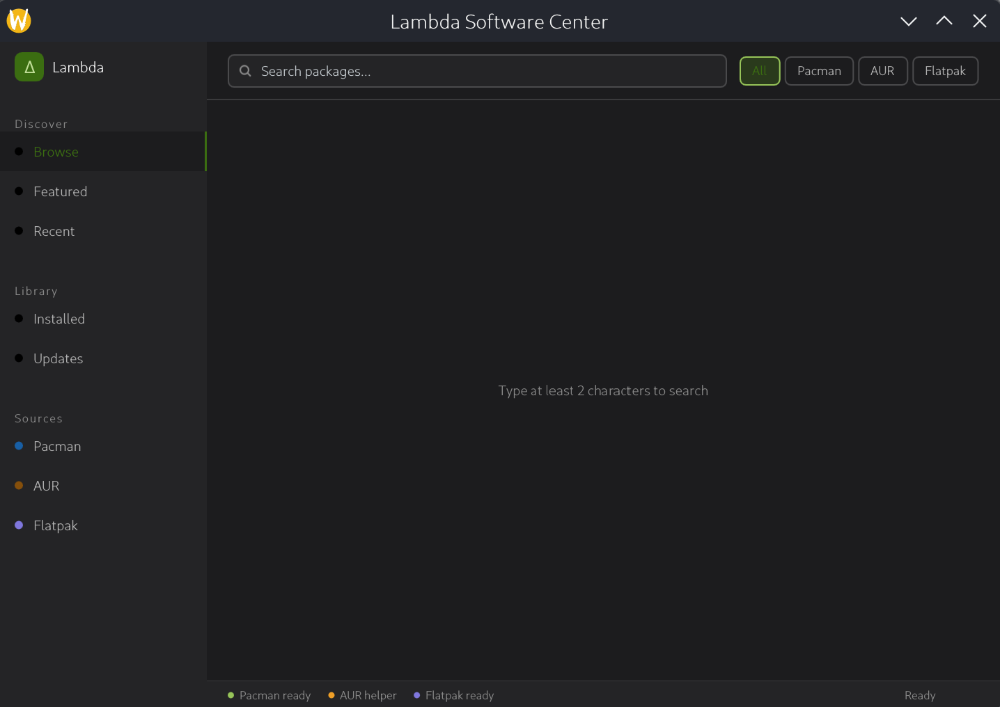

# Lambda Software Center

A native Qt6/QML package manager for Arch Linux — pacman, AUR, and Flatpak in one interface.

Auto-detects system dark/light theme and switches palette live without restart.




## Architecture highlights

libalpm is a linked C library called directly, not through shell commands. libflatpak is stubbed pending installation. Direct calls are what make transaction progress, dependency resolution preview, and typed error handling possible.

AUR is treated as a last-resort escape hatch, not a first-class install path. PKGBUILD review is mandatory and non-skippable by design.

The UI layer is pure QML with no logic. All backend logic lives in C++ with a clean signal/slot boundary.

## Roadmap

| Version | Theme | Key Deliverable |
|---|---|---|
| 0.1.0 | Backend Foundation | ✅ All three backends work headlessly |
| 0.2.0 | Application Shell | ✅ Navigable UI with live search data, system theme auto-detection |
| 0.3.0 | Package Detail View | ✅ Detail page with real metadata, back navigation, ghost Install/Remove buttons |
| 0.4.0 | Install and Remove | ✅ System changes work end to end (pacman + AUR, Flatpak stubbed) |
| 0.5.0 | Update Manager | ✅ Full upgrade flow, per-package update, AUR update detection, UpdatesBanner |
| 0.5.3 | State Refresh + Flatpak Installed | ✅ Install/remove state updates live, Flatpak shows installed badge, Installed page shows all sources |
| 0.6.0 | Discovery and Curation | Featured, categories, curated content |
| 0.7.0 | Background Service | Update notifications without the app open |
| 0.8.0 | Settings | Configurable behavior through the UI |
| 0.9.0 | Polish and Performance | Accessibility, speed, stability |
| 1.0.0 | Stable Release | Packaged and published to AUR and Flathub |

See [docs/lambda-software-center-roadmap.md](docs/lambda-software-center-roadmap.md) for the full version plan.

## Building

Dependencies: Qt 6.7+, libalpm, libflatpak (optional, stubbed if absent), polkit, CMake 3.27+.

```bash
cmake -B build -S .
cmake --build build
```

Run the test suite:

```bash
cd build && ctest
```

## CLI usage

```bash
$ ./lambda-software-center --search firefox
Searching for: firefox
Total results: 737
  [pacman] firefox 150.0-1
  [pacman] curl-impersonate 1.5.5-1.1
  [aur]    yay 12.5.7-1
  ...

$ ./lambda-software-center --list-installed
Installed packages: 1306
  [pacman] a52dec 0.8.0-3.1
  [pacman] aalib 1.4rc5-19.1
  ...

$ ./lambda-software-center --check-updates
Updates available: 12
  firefox: 150.0-1 -> 151.0-1
  mesa: 24.1.0-1 -> 24.2.0-1
  ...
```

## Docs

- [Version Roadmap](docs/lambda-software-center-roadmap.md) — Full feature timeline from v0.1.0 to v1.0.0.
- [UI Specification](docs/lambda-software-center-ui-spec.md) — Design tokens, component catalog, dark/light palette, and layout rules.
- [DECISIONS.md](DECISIONS.md) — Architectural decisions already made. Do not relitigate anything recorded here.

## AI Assistance

This project was built with AI assistance including architecture, code generation, and debugging. All decisions, direction, and review were made by the author. The AI wrote the volume; the human made the calls.